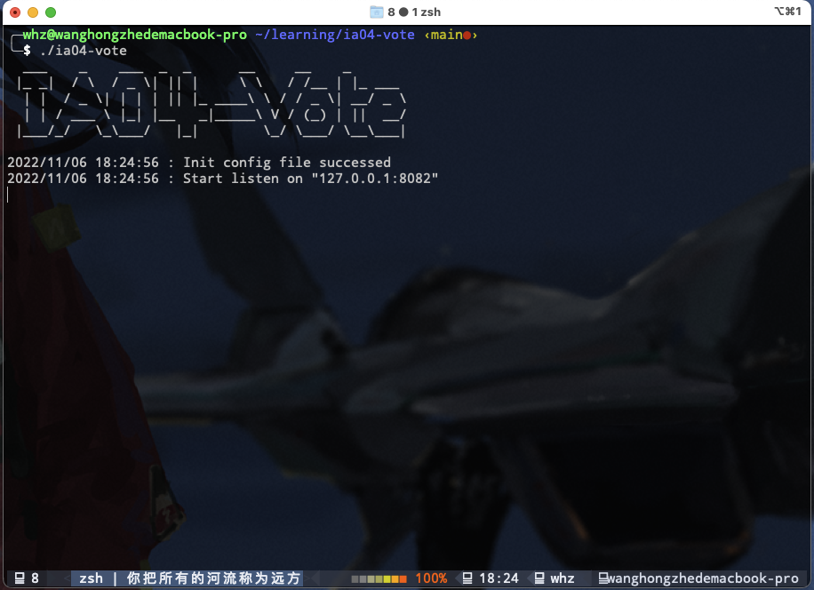
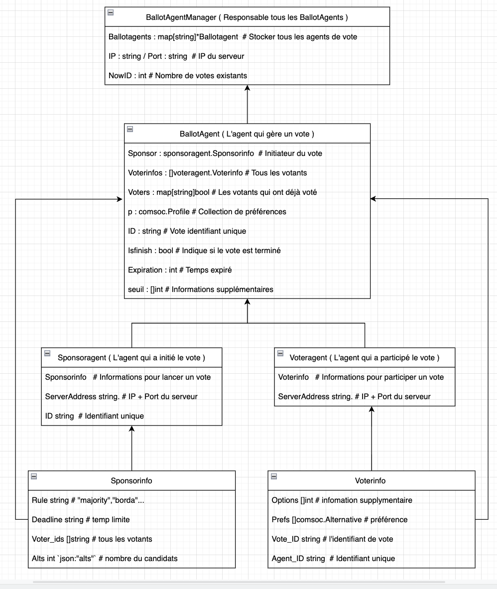
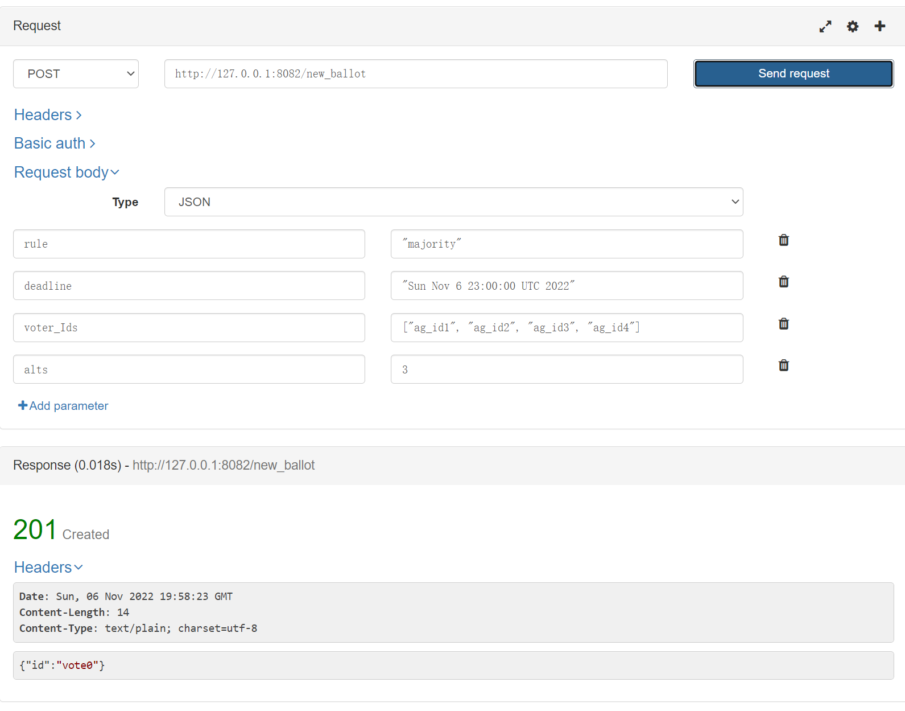
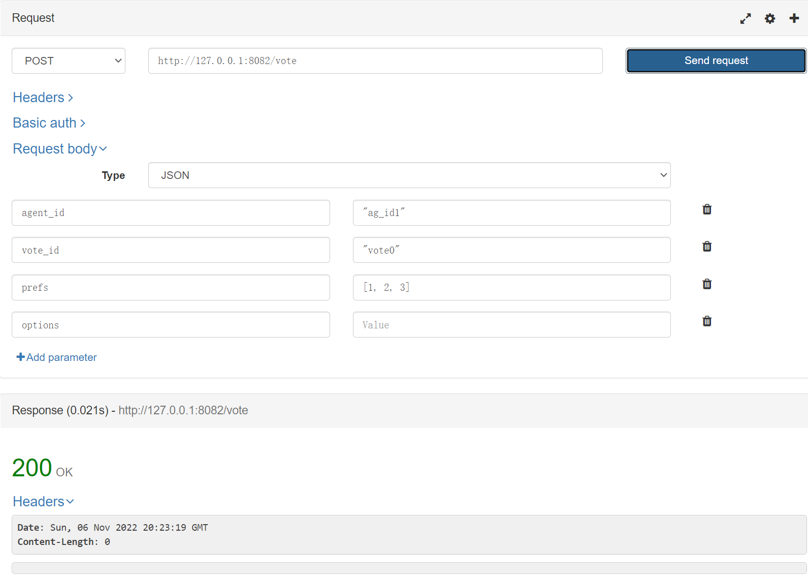
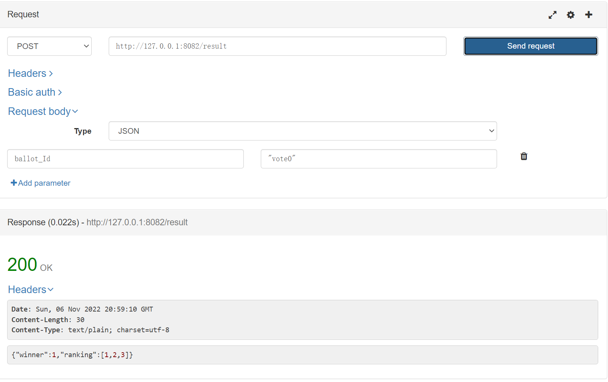
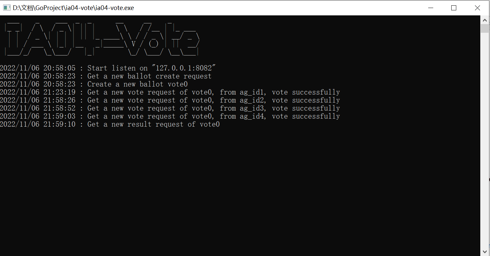
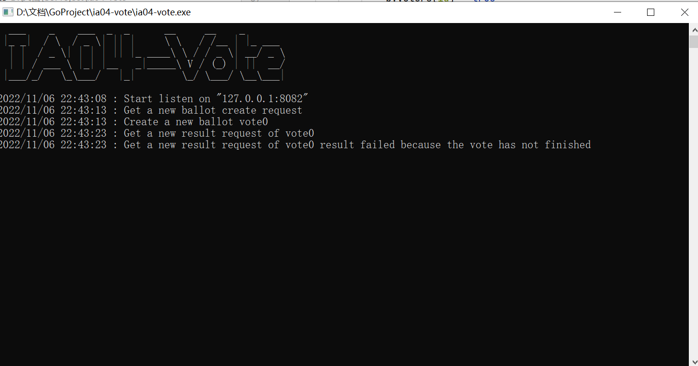
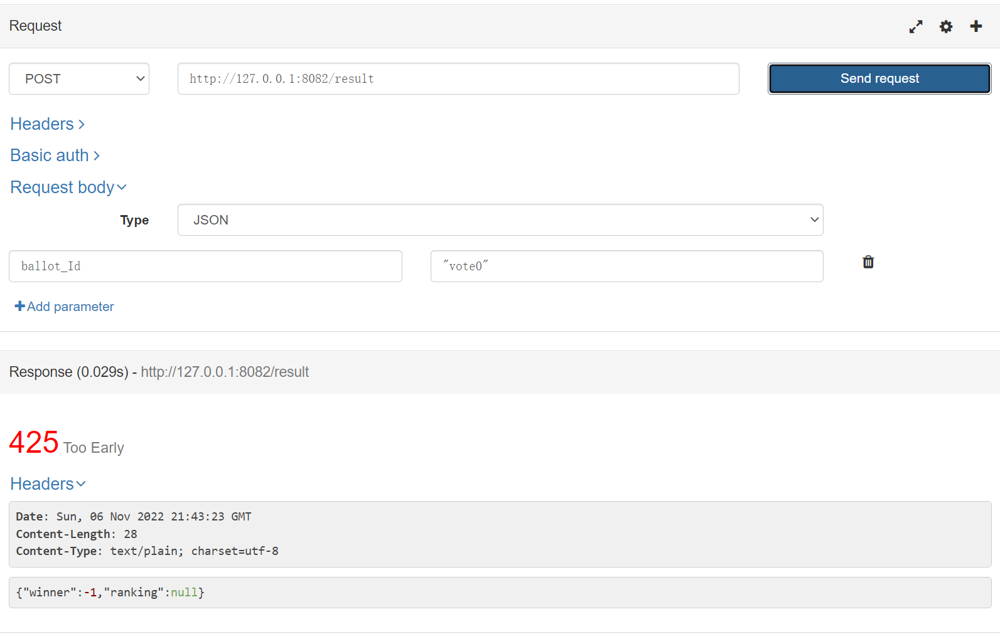

# IA04-Vote

## Brève Introduction

Un système simple de vote, comprenant des programmes du serveur et des API de support côté client, basé sur un modèle multi-agent, qui peut initier, participer un vote et obtenir des résultats. Il prend en charge plusieurs algorithmes de vote courants.

Gitlab repository : [here](https://gitlab.utc.fr/wanhongz/ia04-vote).

---

## Quick Start

### A. Go Build

1. Clonez le code source du projet à partir du site officiel utc gitlab.

```bash
git clone https://gitlab.utc.fr/wanhongz/ia04-vote.git
```

2. Modifiez le fichier de configuration dans le répertoire racine du projet ( **config.json** ), modifiez l'adresse IP et le port de votre serveur ( L'adresse par défaut est **"127.0.0.1:8082"** ).

3. Compilez avec la commande go build.

```go
go build
```

4. Ensuite, vous pouvez trouver l'exécutable **ia04-vote** dans le répertoire racine du projet, l'exécutez

```bash
./ia04-vote
```


### B. Go Install

Vous pouvez également utiliser la commande **go install** pour commencer.

```go
go install -v gitlab.utc.fr/wanhongz/ia04-vote@latest
```

Si tout se passe bien, vous pouvez trouver le fichier exécutable **ia04-vote** dans dossier **bin** sous le chemin **$GOPATH**. 

````shell
$GOPATH/bin/ia04-vote
````


Si tout est normal, vous pouvez voir l'invite de démarrage du serveur



---

## UML



---

## Client API 
Dans cette partie, nous vous présentons les fonctionnalités principales de nos APIs. Ils nous permettent de enregistrer plusieurs ballots de votes en même temps, de choisir la méthode de vote que l'on veut utiliser et d'obtenir le gagnant en utilisant la méthode choisie.

### Méthodes de votes
Nous avons mis en place plusieurs méthodes de votes pour obtenir un gagnant de :
- condorcet 
- majorité
- borda
- kramer-simpson 
- approval
- copeland
- coombs
- stv
- kemeny
- singlepeak

### Création de ballot de vote : /new_ballot
Avec cette commande, nous pouvons désormais créer un ballot de vote. Pour ce faire, il faut renseigner les informations nécéssaires d'un ballot.
- **rule** de type **string**. Choisir entre **"condorcet"**, **"majority"**, **"borda"**, **"kramersimpson"**, **"approval"**, **"copeland"**, **"coombs"**, **"stv"**, **"kemeny"**, **"singlepeak"**
- **deadline** de type **string**
- **voter-Ids** de type **[string, ...]**
- **alts** de type **int**

Voir l'exemple ci-dessous. 201 signifie le succès de création.

Si vous voulez lancer plusieurs votes, changez des informations et envoyez, une nouvelle vote est créée, avec un code **201** retourné.
Les votes sont numérotés apartir de 0.
En cas d'anomalie, **400** est retourné pour **bad request** et **501** pour **not implemented**

### Gestion des votants : /vote
Cette commande sert à renseigner les préférences de chaque votants dans tous les ballots.
De même, les informations des champs sont nécéssaires.
- **agent_id** de type **string**
- **vote_id** de type **string**. Cet ID est celui créé dans **/new_ballot**
- **prefs** de type **[int, ...]**
- **options** de type **int**

Voir l'exemple ci-dessous.


En cas d'anomalie, **400** est retourné pour **bad request**, **403** pour **vote déjà effectué**, **501** pour **not implemented** et **503** pour **la deadline est déjà dépassée**
### Résultats : /result
En renseignant **ballot_Id** de type **string** obtenu précedemment(**votex**), nous pouvons obtenir le résultat. Ce dernier comprend deux partie : le gagnant et le **ranking** (si la méthode de vote nous permet de l'obtenir).

Voir l'exemple ci-dessous.


En cas d'anomalie, **425** est retourné pour **Too early**, signifiant qu'il existe des votants qui n'ont pas encore voté, **404** pour **not found**.

### Fichier exécutable
Le fichier exécutable nous donne la possibilité de savoir l'état de chaque commande. Voici un exemple d'un vote sans erreurs.


En cas d'anomalie, les messages sont aussi affichés, ainsi sur le site d'API.



